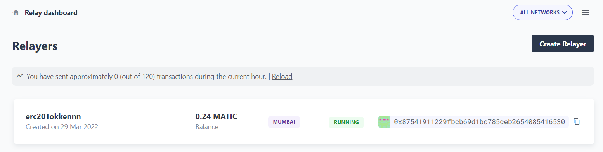

# Staking Contract

> Deploying a simple ERC20 to Polygon Mumbai network usingOpenZeppelin's Defender Relay(api key & secret key) and Alchemy RPC. 

## Built With

- Hardhat
- Solidity
- Mumbai
- Alchemy
- OpenZeppelin's Defender Relay

## Live Demo
- check [Address Transactions on Polygon Mumbai Scan](https://mumbai.polygonscan.com/address/0xaB88a3846FC6798F7a37b7B9d9e8c3c700eF3496)




## Getting Started

To get a local copy up and running follow these simple example steps.

- Fork the repository
- Git clone https://github.com/your-username/ERToken
- git checkout -b branch name
- git remote add upstream https://github.com/jebitok-dev/ERToken
- git pull upstream master
- git commit -m "commit message"
- git push -u origin HEAD

# Basic Sample Hardhat Project

Try running some of the following task:

```shell
$ npm install
$ npx hardhat compile
$ npx hardhat run scripts/deploy.js
$ npx hardhat run scripts/deploy.js --network mumbai
```

## Author

👤 **Author**

- GitHub: [@Jebitok-dev](https://github.com/Jebitok-dev)

## 🤝 Contributing

Contributions, issues, and feature requests are welcome!

Feel free to check the [issues page](issues/).

## Show your support

Give a ⭐️ if you like this project!

## Acknowledgment

 I hereby acknowledge the instructors at [Web3Bridge](Web3Bridge.com) for taking us through smart contract development.